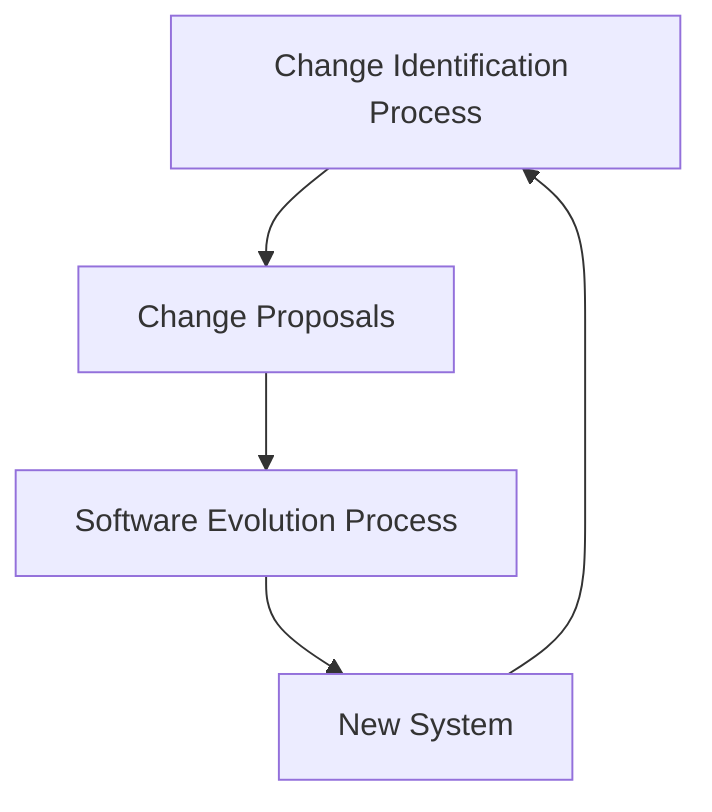
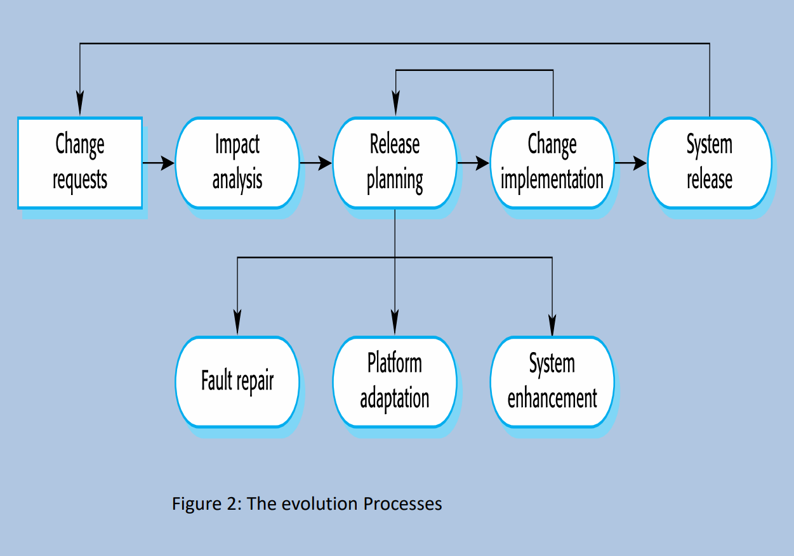

# Software Development Life Cycle

1. Requirement Analysis
2. Planning
3. System Design
4. Implementation (Coding)
5. Testing
6. Deployment
7. Maintenance & Updates

# Roles in Software Development

## Programmers

Write source code.

Displaying text and graphics interpret instructions from software developers and engineers.

## Software Engineers

Apply engineering principles to build software and systems to solve problems.

Use modeling language and other tools to devise solutions.

Adhere to the scientific method and must work in the real world.

## Software Developers

A less formal role than engineers.

Can be involved with specific project areas.

Drive the overall software development lifecycle.

Working across functional teams to transform requirements into features.

Manage development teams and processes, and conducting software testing and maintenance.

# Software Principles and Aspects

Software engineering is intended to support professional software development.

It includes techniques that support program specification, design, and evolution, none of which are normally relevant for personal software development.

# Definition of Software

**Software is an instruction (computer programs), data structures and descriptive information.**

# Categories of Computer Software

* System Software
* Application Software
* Engineering / Scientific Software
* Embedded Software
* Product-line Software
* Web / Mobile Application
* Artificial Intelligent Software

# Attributes of Good Software

* Deliver the required functionality and performance to the user
* Maintainable
* Dependable
* Usable

# Definition of Software Engineering

**Software engineering is an engineering discipline that is concerned with all aspects of software.**

Software contains not only the program, but also all associated documentation and configuration data.

# Type of Software Products

## Generic Products

Stand-alone systems that are produced by a development organization and sold on the open market to any customer who is able to buy them.

## Customized Products

Systems that are commissioned by a particular customer. A software contractor develops the software especially that customer.

# Importance of Software Engineering

* The requirements of reliable and trustworthy systems are increasing nowadays. So we need to be able to produce such systems economically and quickly.
* It is usually cheaper to use software engineering methods and techniques for software systems.
* For most types of systems, the majority of costs are the costs of changing the software after it has gone into use.

# Software Process Activities

* Software Specification
  * Customers and engineers define the software that is to be produced and the constraints on its operation.
* Software Development
  * Design and program the software.
* Software Validation
  * The software is checked to ensure that it is what the customer requires.
* Software Evolution
  * Modify the software to reflect changing customer and market requirements.

# General Issues that Affect Software

## Heterogeneity

Increasingly, systems are required to operate as distributed systems across networks that include different types of computer and mobile devices.

## Business and Social Change

Business and society are changing quickly as emerging economics develop, and new technologies become available. They need to be able to change their existing software and to rapidly develop new software.

## Security and Trust

It is essential that we can trust that software as it is intertwined with all aspects of our lives.

## Scale

Software has to be developed across a very wide range of scales.

# Software Engineering Diversity

* There are many different types of software system, and there is no universal set of software techniques that is applicable to all of these.
* The software engineering methods and tools used depend on the type of application being developed, the requirements of the customer and the background of the development team.

# Application Types

* Stand-alone applications
  * Running on local computer and do not need to be connected to a network.
* Interactive Transaction-based Applications
  * Applications that execute on a remote computer and are accessed by users from their own PCs or terminals.
* Embedded Control Systems
  * Control and manage hardware devices. Numerically, there are probably more embedded systems than any other type of system.
* Batch Processing Systems
  * Business systems that are designed to process data in large batch.
* Entertainment Systems
  * For personal use and are intended to entertain the user.
* System for Modelling and Simulation
  * Developed by scientists and engineers to model physical processes or situations.
* Data Collection Systems
  * Collect data from their environment by using a set of sensors and send the data to other systems for processing.
* System of systems
  * Systems that are composed of a lot of other software systems.

# Software Engineering Fundamentals

* Systems should be developed using a managed and understood development process.
* Dependability and performance are important for all types of system.
* Understanding and managing the software specification and requirements are important.
* Reuse software that has already been developed instead of writing new software.

# Internet Software Engineering

* Web services allow application functionality to be accessed over the web.
* Cloud computing is an approach to the provision of computer services where applications run remotely on the `cloud`.
* Users do not buy software but pay according to use.

# Web-based Software Engineering

* Web-based systems are complex distributed systems.

# Web Software Engineering

* Software Reuse
  * It is the dominant approach for constructing web-based systems.
* Incremental and Agile Development
  * Web-based systems should be developed and delivered incrementally.
* Service-oriented Systems
  * Software components are stand-alone web services.
* Rich Interfaces

# Software Evolution

* Software development does not stop when a system is delivered but continues throughout the lifetime of the system.
* It inevitably has to change if it is to remain useful after deploy.
* Software evolution may be triggered by,
  * Changing business requirements
  * Reports of software defects
  * Change to other systems

# Evolution Processes

* System change proposals are the driver for system evolution in all organizations.
  * Change proposals may come from
    * existing requirements that have not been implemented
    * request of new requirements
    * bug report
    * new ideas
* The changes are implemented and validated, then a new version of the system is released.

## 3 Reasons for the Urgent Changes

1. A serious system fault occurs that has to be repaired to allow normal operation to continue.
2. Changes to the systems operating environment have unexpected effects that disrupt normal operation.
3. There are unanticipated changes to the business running the system.