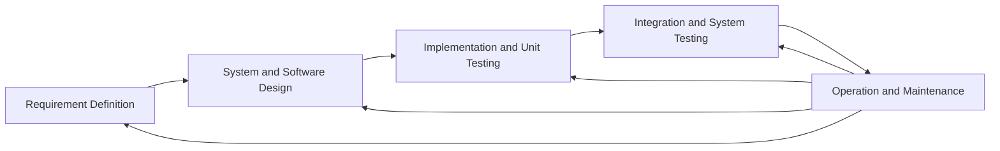
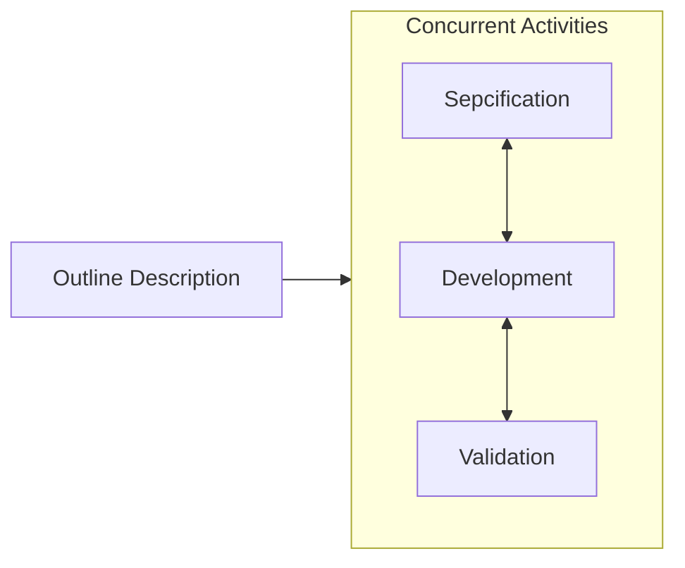

# Definition and Features of Software Process

* A software process is a set of related activities that lead to the production of a software product.
* Software processes are complex.
* Software processes rely on people making decisions and judgments.
* There is no ideal process.

# Types of Software Processes

In practice, most practical processes include elements of both types.

## Plan-driven Processes

* All the processes activities are planned in advance.
* Process is measured against this plan.

## Agile Processes

* Planning is incremental.
* It is easier to change the process to reflect changing customer requirements.

# Software Process Model

* A software process model is a simplified representation of a software process.

## The Waterfall Model

* It is an example of plan-driven process.

### Phases

* Requirements Analysis and Definition
  * Establish services, constraints, and goals by consultation with system users.
  * Defined in detail.
  * Serve as a system specification.
* System and Software Design
  * Allocate the requirements to either hardware or software system by establishing an overall system architecture.
  * Identifying and describing the fundamental software system abstractions and their relationships.
* Implementation and Unit Testing
  * Software design is realized as a set of programs of program units.
  * Unit testing involves verifying that each unit meets its specification.
* Integration and System Testing
  * The individual program units or programs are integrated and tested as a complete system.
  * After testing, the software system is delivered to the customer.
* Operation and Maintenance
  * The system is installed and put into practical use.
  * Maintenance involves correcting errors which were not discovered in earlier stages.

### Problems

* It is difficult to make any change during the development process. In principle, a phase has to be done before moving onto the next phase.
* Inflexible partitioning of the project into distinct stages makes it difficult to respond to changing customer requirements.
* The waterfall model is mostly used for large system engineering projects, where a system is developed at several sites.

## Incremental Model

* Incremental development is based on the idea of developing an initial implementation, exposing this to user comment and evolving it through several versions until an adequate system has been developed.
* It is an agile process.

