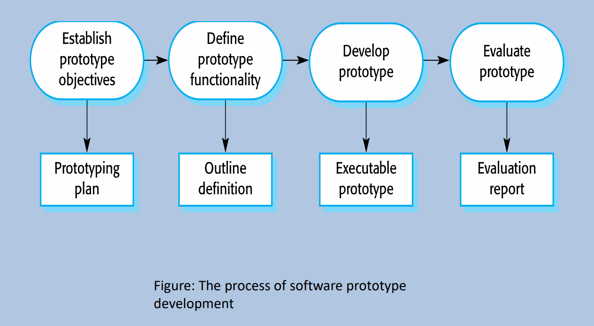

# Definition and Features of Software Process

* A software process is a set of related activities that lead to the production of a software product.
* Software processes are complex.
* Software processes rely on people making decisions and judgments.
* There is no ideal process.

# Types of Software Processes

In practice, most practical processes include elements of both types.

## Plan-driven Processes

* All the processes activities are planned in advance.
* Process is measured against this plan.

## Agile Processes

* Planning is incremental.
* It is easier to change the process to reflect changing customer requirements.

# Software Process Model

* A software process model is a simplified representation of a software process.

## The Waterfall Model

* It is an example of plan-driven process.

### Phases

* Requirements Analysis and Definition
  * Establish services, constraints, and goals by consultation with system users.
  * Defined in detail.
  * Serve as a system specification.
* System and Software Design
  * Allocate the requirements to either hardware or software system by establishing an overall system architecture.
  * Identifying and describing the fundamental software system abstractions and their relationships.
* Implementation and Unit Testing
  * Software design is realized as a set of programs of program units.
  * Unit testing involves verifying that each unit meets its specification.
* Integration and System Testing
  * The individual program units or programs are integrated and tested as a complete system.
  * After testing, the software system is delivered to the customer.
* Operation and Maintenance
  * The system is installed and put into practical use.
  * Maintenance involves correcting errors which were not discovered in earlier stages.

### Problems

* It is difficult to make any change during the development process. In principle, a phase has to be done before moving onto the next phase.
* Inflexible partitioning of the project into distinct stages makes it difficult to respond to changing customer requirements.
* The waterfall model is mostly used for large system engineering projects, where a system is developed at several sites.

## Incremental Model

* Incremental development is based on the idea of developing an initial implementation, exposing this to user comment and evolving it through several versions until an adequate system has been developed.
* It is an agile process.

### Benefits of Incremental Process

1. Reduce the cost of accommodating changing customer requirements.
2. It is easier to get customer feedback.
3. More rapid delivery and deployment of useful software.

### Problems

* From a management perspective
  1. The process is not visible.
  2. System structure tends to degrade as new increments are added.

### Prototyping

* A prototyping is an initial version of a software system.
  * Demonstrate concepts.
  * Try out design options.
  * Find out more about the problem and possible solutions.
* Rapid, iterative development of the prototyping is essential so that costs are controlled, and system stakeholders can experiment with the prototype early in the software process.
* 
* A software prototype can be used in a software development process to help anticipate changes that may be required:
  * **In the requirements engineering process,** a prototype can help with the elicitation and validation of system requirements.
  * **In the system design process,** a prototype can be used to explore particular software solutions and to support user interface design.
  * **A system prototype can be used while the system is being designed to carry out design experiments to check the feasibility of proposed design.**
  * **Prototyping is also an essential part of the user interface design process.**

#### Benefits of Prototyping

* Improve system usability.
* A closer match to users' real need.
* Improve design quality.
* Improve maintainability.
* Reduced development effort.

#### General Problems of Prototyping

* The prototype may not necessarily be used in the same way as the final system.
* The tester of prototype may not be typical of system users.
* The training time during prototype evaluation may be insufficient.
* If the prototype is slow, the evaluators may adjust their way of working and avoid those system features that have slow response times.

## Spiral Model

### Phases

* **Planning:**
  * Estimate the cost.
  * Schedule and resources for the iteration.
  * Understand the system requirements for continuous communication between the system analyst and the customer.
* **Risk Analysis:**
  * Identify potential risk.
  * Plan and finalize risk mitigation strategy.
* **Engineering:**
  * Testing, coding, deploying software at the customer site.
* **Evaluation:**
  * Evaluate the software by customer.
  * Identify and monitor risks such as schedule slippage and cost overrun.

## Rational Unified Process

* It brings together elements from all the generic models and supports prototyping and incremental delivery.
* Rational Unified Process is normally described from 3 perspectives:
  1. A dynamic perspective shows the phases of the model over time.
  2. A static perspective shows the process activities that are enacted.
  3. A practice perspective suggests good practices to be used during the process.

### Workflow

* **Business Modelling:** The business process are modelled using business use cases.
* **Requirements:** Actors who interact with the system are identified and use cases are developed to model the system requirements.
* **Analysis and Design:** A design model is created and documented using architectural models, component models, object models, and sequence models.
* **Implementation:** The components in the system are implemented and structured into implementation sub-systems.
* **Testing:** It is an iterative process that is carried out in conjunction with implementation. System testing follows the completion of the complementation.
* **Deployment:** A product release is created, distributed to users and installed in their workplace.
* **Configuration and Change Management:** Support workflow managed changes to the system.
* **Project Management:** Support workflow manages the system development.
* **Environment:** This workflow is concerned with making appropriate software tools available to the software development team.

## Comparison and Conclusions

<table border="1">
  <thead>
    <tr>
      <th>Model</th>
      <th>Advantages</th>
      <th>Disadvantages</th>
    </tr>
  </thead>
  <tbody>
    <tr>
      <td><strong>Waterfall Model</strong></td>
      <td>
        <ol>
          <li>Easy to understand and implement</li>
          <li>Reinforces good habits: define-before-design and design-before-code.</li>
          <li>Identifies deliverables and milestones</li>
          <li>Works well on mature deliverables</li>
        </ol>
      </td>
      <td>
        <ol>
          <li>Real projects rarely follow sequential approach</li>
          <li>Uncertainty at the beginning of the development</li>
          <li>No working version of the system until very late</li>
        </ol>
      </td>
    </tr>
    <tr>
      <td><strong>Incremental Model</strong></td>
      <td>
        <ol>
          <li>Divides project into smaller parts</li>
          <li>Creates working model early</li>
          <li>Feedback from one phase provides information for the next phase</li>
          <li>Very useful when more staffing is unavailable</li>
        </ol>
      </td>
      <td>
        <ol>
          <li>Users need to be actively involved in the project.</li>
          <li>Communication and coordination skills are central process</li>
          <li>Informal requests for improvement for each phase may lead to confusion</li>
          <li>It may lead to scope creep</li>
        </ol>
      </td>
    </tr>
    <tr>
      <td><strong>Spiral Model</strong></td>
      <td>
        <ol>
          <li>Designed to include the best features from Waterfall and Prototyping Model</li>
          <li>Good for large and mission-critical projects</li>
          <li>Introduces risk assessment as a new component</li>
        </ol>
      </td>
      <td>
        <ol>
          <li>Can be a costly model to use</li>
          <li>Risk analysis requires specific expertise</li>
          <li>Project’s success is highly dependent on risk analysis phase</li>
          <li>Doesn’t work well for smaller projects</li>
        </ol>
      </td>
    </tr>
  </tbody>
</table>

# Agile Software Development

## Rapid Software Development

* Rapid development and delivery is now often the most important requirement for software systems
  * **Business operate in a fast:** changing requirements, and it is practically impossible to produce a set of stable software requirements.
  * Software has to evolve quickly to reflect changing business needs.
* Plan-driven development is essential for some types of system but does not meet these business needs.
* Agile development methods emerged in the last 1990s, whose aim was to radically reduce the delivery time for working software systems.

## Features of Agile Development

* Program specification, design and implementation are inter-leaved.
* The system is developed as a series of versions or increments with stakeholders involved in version specification and evaluation.
* Frequent delivery of new versions for evaluation.
* Extensive tool support used to support development.
* Minimal documentation: focus on working code.

## Plan-driven and Agile Development

### Plan-based Development

* A plan-driven approach to software engineering is based around separate development stages with the outputs to be produced at each of these stages planned in advance.
* Not necessarily waterfall model. Incremental development is possible.
* Iteration occurs within activities.

### Agile Development

* Specification, design, implementation and testing are inter-leaved.
* The outputs from the development process are decided through a process of negotiation during the software development process.

### Agile Methods

* Focus on code rather than the design.
* Are based on an iterative approach to software development.
* Are intended to deliver working software quickly and evolve this quickly to meet changing requirements.
* To reduce overheads in the software process and to be able to respond to changing quickly.
* Without excessive rework.

### Principle of Agile Methods

| Principle            | Description                                                                                                                                                             |
| -------------------- | ----------------------------------------------------------------------------------------------------------------------------------------------------------------------- |
| Customer Involvement | Customers should be closely involved throughout the development process to provide and prioritize new system requirements and to evaluate the iterations of the system. |
| Incremental Delivery | The software is developed in increments with the customer specifying the requirements to be included in each increment.                                                 |
| People Not Process   | The skills of the development team should be recognized and exploited. Team members should be left to develop their own way of working without prescriptive processes.  |
| Enhance Change       | Except the system requirements to change and so design the system to accommodate these changes.                                                                         |
| Maintain Simplicity  | Focus on simplicity in both the software being developed and in the development process. Actively work to eliminate complexity from the system.                         |

### Agile Method Applicability

* Product development where a software company is developing a small or medium-size product for sale.
* Custom system development within an organization, where there is a clear commitment from the customer to become involved in the development process and where there are few external rules and regulations that affect the software.

# Extreme Programming (XP)

* The most widely used agile process. It uses object-oriented approach.

## XP Planning

* Begin with listening, leads to creation of "user stories" that describes required output, features, and functionality. Customer assign a value like priority to each story.
* Agile team assesses each story and assign the cost.
* Working together. Stories are grouped for a deliverable increment next release.
* A commitment (stories to be included, delivery date and other project matters) is made. Three ways:
  1. Either all stories will be implemented in a few weeks.
  2. High priority stories first.
  3. The riskiest stories will be implemented first.
* After the first increment "project velocity", namely number of stories implemented during the first release is used to help define subsequent delivery dates for other increments.
* Customers can add stories, delete existing stories, change value of an existing story, split stories as development work proceeds.

## XP Design

* Occur both before and after coding as refactoring is encouraged.
* Follow the `KIS` principle (Keep it simple). Nothing more nothing less than the story.
* Encourage the use of CRC (class-responsibility-collaborator) cards in an object-oriented context. The only design work product of XP. They identify and organize the classes that are relevant to the current software increment.
* For difficult design problem, suggests the creation of "spike solutions" -- a design prototype for that portion is implemented and evaluated.
* Encourage "refactoring" -- an iterative refinement of the internal program design. Does not alter the external behavior yet improve the internal structure. Minimize chances of bugs. More efficient, easy to read.

## XP Coding

* Recommend the construction of a unit test for a story before coding commences. So implementer can focus on what must be implemented to pass the test.
* Encourage "pair programming". Two people work together at one workstation. Real time problem-solving, real time review for quality assurance. Take slightly different roles.

## XP Testing

* All unit tests are executed daily and ideally should be automated. Regression test are conducted to test current and previous components.
* "Accept tests" are defined by the customer and executed to assess customer visible functionality.

# SCRUM Process Flow

* Development work is partitioned into "packets".
* Testing and documentation are ongoing as the product is constructed.
* Work units occur in "sprints" and is derived from a "backlog" of existing changing prioritized requirements.
* Changes are not introduced in sprints (short term but stable) but in backlog.
* Meetings are very short (15 minutes daily) and sometimes conducted without chairs.
* `demos` are delivered to the customer with the time-box allocated. May not contain all functionalities. So customers can evaluate and give feedbacks.