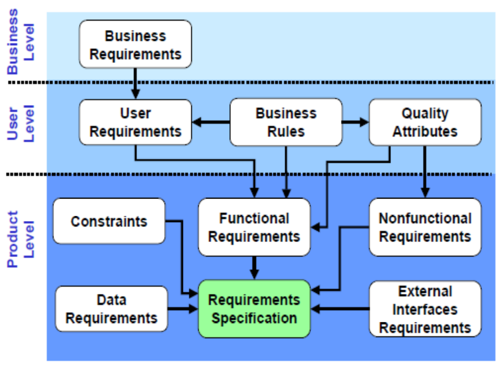
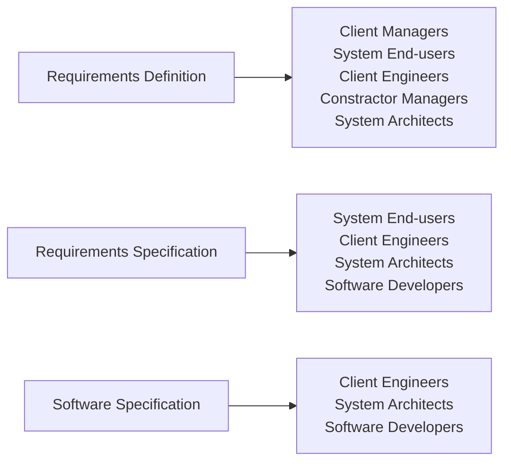
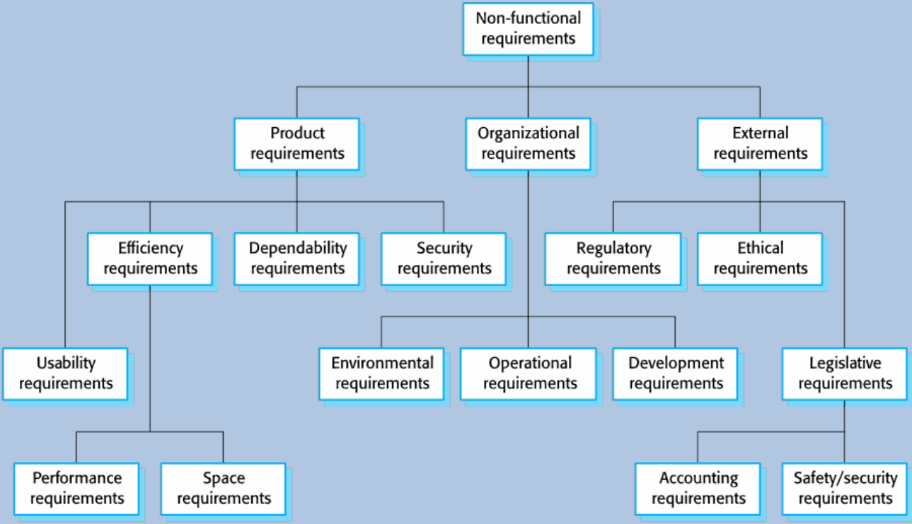
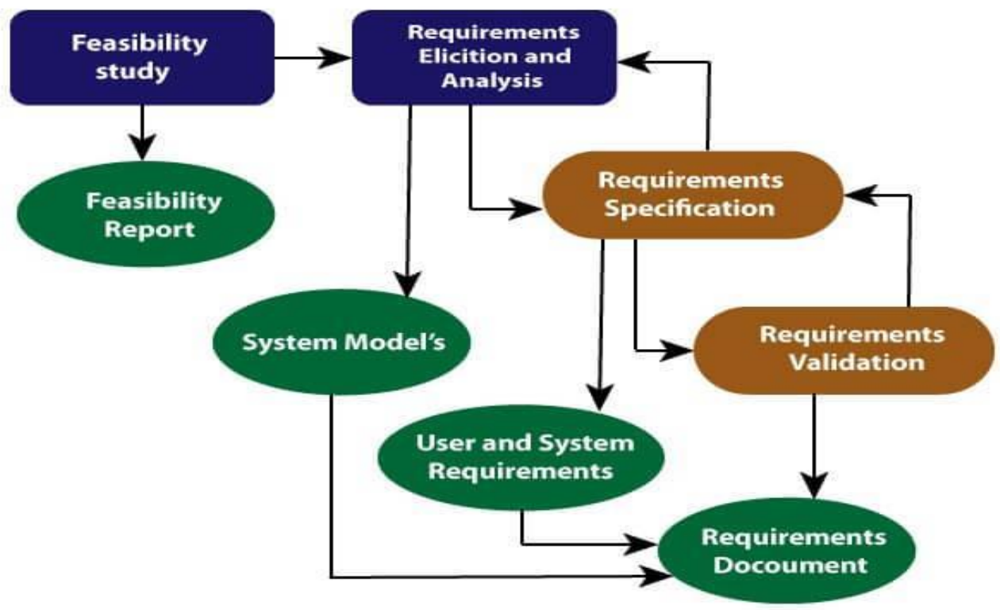
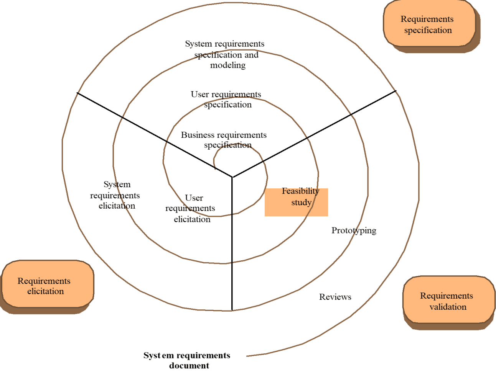
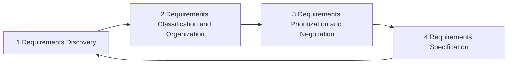
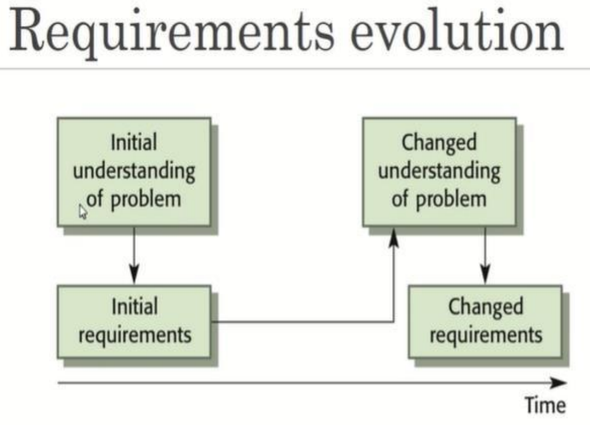
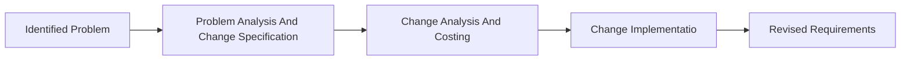

# Requirement Engineering

## Definition & Properties

* Requirement engineering is the process of establishing
  1. the services that the customer requires from a system.
  2. the constraints under which it operates and is deployed.
* The requirements for a system are the descriptions of what the system should do the services and the constraints.
* Requirements describe the necessary functions and features of the system, which includes
  * Performance
  * Schedule
  * Cost
  * Other Characteristics (e.g. lifecycle properties)
* Requirements are often organized hierarchically.
  * At a high level requirements focus on what should be achieved, not how to achieve it.
  * Requirements are specified at every level, from the overall system to each hardware and software component.
* The IEEE Standard Glossary of Software Engineering Terminology defines a requirement as: A condition or capability needed by a user to solve a problem or achieve an objective.
* Requirements may range from a high-level abstract statement of a service or of a system constraint to a detailed mathematical functional specification.
* Requirement is inevitable as it may serve a dual function.
* Requirements may be the basis for a bid for a contract, therefore must be open to interpretation.
* Requirements may be the basis for the contract itself, therefore must be defined in detail.

# Type of Requirements

## Business Requirements

* Outline measurable goals for the business.
* Define the `why` behind a software project.
* Match project goals to stakeholder goals.
* Maintain a BRD with requirements, updates or changes.

## User Requirements

* Reflect specific user needs or expectations.
* Describe the `who` of a software project.
* Highlight how users interact with it.
* Create a URS, or make them part of the BRD.

## Software Requirements

* Identify features, functions, non-functional requirements and use cases.
* Delve into the `how` of a software project.
* Describe software as functional modules and non-functional attributes.
* Compose an SRS, and optionally, an FRS.

## Types of Readers

# Functional and Non-functional Requirements

* **Functional Requirement:** These are statements of services the system should provide, how the system should react to particular inputs and how the system should behave in particular situations.
* **Non-functional Requirement:** These are constraints on the services or functions offered by the system.

## Implementation of Non-functional Requirements

Non-functional requirements may affect the overall architecture of a system rather than individual component.

## Classification of Non-functional Requirements

* Product Requirements
  * Requirements which specify that the delivered product must behave in a particular way. (e.g. execution speed, reliability)
* Organizational Requirements
  * Requirements which are a consequence of organizational policies and procedures. (e.g. process standards used, implementation requirements)
* External Requirements
  * Requirements which arise from factors which are external to the system and its development process. (e.g. interoperability requirements, legislative requirements)

# Domain Requirement

* The system's operational domain imposes requirements on the system.
* Domain requirements can be new functional requirements, constraints on existing requirements, or define specific computations.
* If domain requirements are not satisfied, the system may be unworkable.

## Domain Requirements Problems

* **Understandability**
  * Requirements are expressed in the language of the application domain, which is often not understood by software engineers developing the system.
* **Implicitness**
  * Domain specialists understand the area so well that they do not think of making the domain requirements explicit, which leads software developers to implement the requirements in the wrong way.

# Requirements Engineering Processes

* The processes used for requirements engineering vary widely depending on the application domain, the people involved and the organization developing the requirements.
* The goal of this stage of the software engineering process is to help create and maintain a system/software requirements document.

## Processes

1. Requirements Elicitation
  * What services do the end-users require of the system?
2. Requirements Analysis
  * How do we classify, priorities and negotiate requirements?
3. Requirements Validation
  * Does the proposed system do what the user require?
4. Requirements Management
  * How do we manage the (sometimes inevitable) changes to the requirements document?

## Four High-Level Activities

* Feasibility Study
* Elicitation and Analysis
* Specification
* Validation

### Feasibility Study

* A short, focused study that should take place early in the requirement engineering process. It should answer three key questions:
  * does the system contribute to the overall objectives of the organization?
  * can the system be implemented within schedule and budget using current technology?
  * can the system be integrated with other systems that are used?

### Elicitation and Analysis

* Software engineers work with customers and system end-users to find out about the application domain, what services the system should provide, the required performance of the system, hardware constraints, and so on.
* Stakeholders (end-users, managers, engineers) also may involve in maintenance, domain experts, trade unions, etc.

## Requirements Engineering Processes

* **Requirement Discovery:** Interact with stakeholders of the system to discover their requirements.
* **Requirements Classification and Organization:** Take the unstructured collection of requirements, groups related requirements, and organizes them into coherent clusters.
* **Requirements Prioritization and Negotiation:** This activity is concerned with prioritizing requirements and finding and resolving requirements conflicts through negotiation.
* **Requirements Specification:** The requirements are documented and input into the next round of the spiral.

## Requirements Validation

* Requirements validation is the process of checking a software system meets specification, what the customer needs.

### Types of Validation

* **Validity Checks:** A user may think that a system is needed to perform certain functions.
* **Consistency Checks:** Requirements in the document should not conflict.
* **Completeness Checks:** The requirements document should include requirements that define all functions and the constraints intended by the system user.
* **Realism Checks:** Using knowledge of existing technology, the requirements should be checked to ensure that they can actually be implemented.
* **Verifiability:** To reduce the potent, system requirements should always be written so that they are verifiable.

### Requirements Validation Techniques

* **Requirements Reviews:** Analyze the requirements systematically, checking for errors and inconsistencies.
* **Prototyping:** An executable model of the system in question is demonstrated to end-users and customers.
* **Test-case Generation:** Requirements should be testable.

# Requirement Management

* Requirement management is the process of understanding and controlling changes to system requirements.
* Planning is an essential first stage in the requirement management process.
* Planning stage establishes the level of requirements managements detail that is required.

## Requirement Management

* Process of managing changing requirements during the requirements engineering process and system development.
  * Emerging new requirements.
  * Keep track of individual requirements.
  * Maintain links between dependent requirements to assess the impact of requirements changes.
  * A formal process needed for making change proposals and linking these to system requirements.

## Changing Requirements

* The business and technical environment of the system always changes after installation.
* The users of the system are rarely the same people.
* Large systems usually have diverse users with different requirements.

## Requirement Change Management

* During this stage, the problem or the change proposal is analyzed to check that it is valid. This analysis is fed back to the change requestor who may respond with a more specific requirements change proposal, or decide to withdraw the request.
* The effect of the proposed change is assessed using traceability information and general knowledge of the system requirements. Once this analysis is completed, a decision is made whether to proceed with the requirements change.
* The requirements document and, where necessary, the system design and implementation, are modified. Ideally, the document should be organized so that changes can be easily implemented.

# Software Requirements Documentation/Specification

## Definition

* The process of writing down the user and system requirements in a requirements document.
* User requirements have to be understandable by end users and customers who do not have a technical background.
* System requirements are more detailed requirements and may include more technical information.
* The requirements may be part of a contract for the system development.
* It is therefore important that these are as complete as possible.

## Need for SRS

* Help user understand his needs.
* SRS provides a reference for validation of the final product.
* High quality SRS essential for high Quality SW.
* Good SRS reduces the development cost.

## Structure of SRS

* Preface (including change history)
* Introduction
* Contents
* Glossary
* User requirements definition
* System architecture
* System requirements specification
* System models
* System evolution
* Appendices
* Index

## Key Characteristics of a Good SRS

* Some key ones are complete
* Unambiguous
* Consistent
* Verifiable
* Ranked for important and/or stability

## Requirements Document/Specification (SRS)

* The official statement of what is required of the system developers.
* Should include both a definition and a specification of requirement.
* It is not a design document.
* Set of what the system should do rather than how it should do it.
* **Specify external system behavior.** (What does it do?)
* **Specify implementation constraints.** (What system it must run on, what programming language it must use?)
* **Easy to change.** Serve as reference tool for maintenance.
* **Record forethought about the life cycle of the system.** (How can it be expanded for more users?)
* **Characterize response to unexpected events.** (e.g. What should it do if power is lost?)
* The level of detail depends on both the type of system and the development process being used.
* In evolutionary development model the requirements may change many times.
* In the waterfall model, it should be more complete before design stage.
* If the (sub-)system developed by an external contractor, or it is a critical system, more time needs to be taken on finalizing the requirements document.

### Way of Writing a System Requirements Specification

* Natural Language
  * mostly used, with some structure for the document Formal languages are precise and unambiguous, but hard Formal languages used for special features or in highly critical systems.
  * Lack of clarity.
  * Functional and non-functional requirements tend to be mixed-up in same document.
  * Several requirements may be expressed together, leading to problems with testing/debugging.
* Structured Natural Language
  * The requirement writer is limited and requirements are written in a standard way.
  * This works well for some types of requirements.
  * Form-based specifications:
    * Definition of the function or entity.
    * Description of inputs and where they come from.
    * Description of outputs and where they go to.
    * Information about the information needed for the computation and other entities used.
    * Description of the action to be taken.
    * Pre- and post-conditions (if appropriate).
    * The side effects (if any) of the function.
* Design Description Languages
* Graphical Notations
* Mathematical Specifications

# Use Case

* A description of the interactions possible between actors and system, that when executed, provide added value.
* Use case diagrams provide an overview.
* Use case descriptions provide the details.